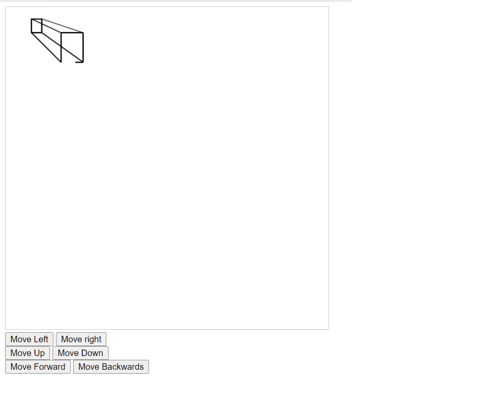

<!-- vscode-markdown-toc -->
* 1. [Progress](#Progress)
* 2. [File Explanation](#FileExplanation)
* 3. [Mathematics](#Mathematics)

<!-- vscode-markdown-toc-config
	numbering=true
	autoSave=true
	/vscode-markdown-toc-config -->
<!-- /vscode-markdown-toc -->

# 3D-Engine
A custom 3D engine made with python and JavaScript

##  1. Progress
The MVP (minimum viable product) has now been created. This consists of the rendering of a wireframe of a cube, with some buttons to move it around. This code works for the online JavaScript renderer but not for the terminal renderer. This is because I was originally aiming to develop it for the terminal. However, the the terminal does not have good enough graphical detail. As a result, I have switched to an online renderer.

Below, you can see the current work that I have:

(Note that this is still very much a work in progress)

My next steps are to:
* Improve the format of teh data required to draw 3D data, possible reading stl or obj file
* Add rotation
* Add more sophisticated rendering abilities
* Add a better control system

##  2. File Explanation
Originally, I aimed to develop this for the terminal before realising this was infeasable. Therefore, I switched to a web based renderer using JavaScript. Therefore, some files are not out of date

* Out of date files (from the old terminal renderer)
    * render_terminal.py - renders the graphics onto the terminal
    * maths.py - The maths used, in Python
    * pygame_setup.py - From when I was testing it in pygame

* Current files (for the JavaScript renderer)
    * render_web.py - loads the web page as a web server, for use with github codespaces
    * Everything in templates folder - contains HTML files
    * Everything in static folder - contains static content and JavaScript

##  3. Mathematics
This 3D engine was originally based on some mathematics which I derived. Below, you can see the main equation, to find where a point should be based on a number of variables:

* l = distance between screen and camera

* z = z position of point to plot

* d = l-z = distance from point to camera

* x = d-l = distance from point to screen

* c = x or y position of camera

* p = x or y position of point

* r = resultant x or y position of point

`         /          - 1/    d   \ \` 

`r = xtan|180 - tan    |--------| | + p ` 

`         \             \|c - p| / / `  

However, this approach had a number of problems:
* The equation was producing difficult numbers like negative numbers, and it was hard to understand ow to produce nicer numbers
* The equation was complicated, requiring more processing power
* The equation was not completely working

As a result, I did some research, and switched it to the following equation, which solved all these issues:

`point_projected = (focal_length*point)/(focal_length+z)`

This required some changes in the program's visualisation of the 3D scene - it now considers the object, screen and camera in a slightly different order
